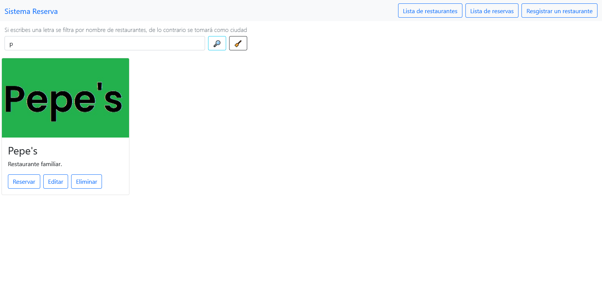
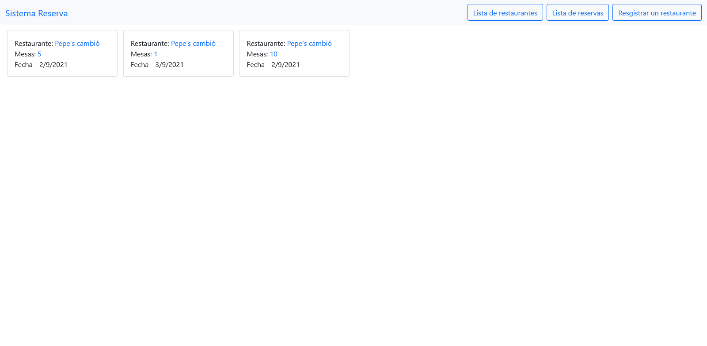

# Sistema de reserva en Restaurantes

La aplicación corre en el puerto 4000 inicia el servidor con **npm run dev**

## Restaurantes
- **/v1/api/restaurantes/**     Listado de Restaurantes. (get)
- **/v1/api/restaurantes/**     Crea un restaurante. (post)
- **/v1/api/restaurantes/ciudad**   Listado de restaurantes por ciudad. (get)
- **/v1/api/restaurantes/letra**    Listado de restaurantes por letra. (get)
- **/v1/api/restaurantes/nit**      Dependiendo de el protocolo http (put / delete) actualiza o elimina un restaurante.

## Reserva
- **/v1/api/reservas/**     Listado de reservas. (get)
- **/v1/api/reservas/**     Crea una reserva. (post)

## Imagenes

    
     
    
     
    
     
    
     
    
     
    
     
    
     
    
     
    
     
    
     
    
     

